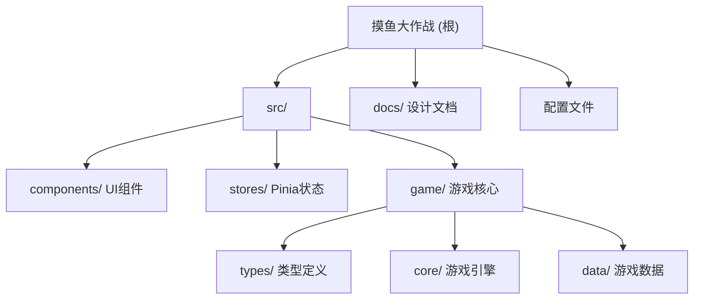

# 摸鱼大作战 (Slack Master 2024) - AI 开发导航

> 像素风程序员职场生存模拟游戏 | Vue 3 + TypeScript + Vite

最后更新: 2026-02-10

---

## 项目快照

这是一款**2D文字冒险/RPG游戏**，玩家扮演程序员在职场中通过"工作"与"摸鱼"的平衡策略生存30天。

**技术栈**:
- Vue 3.5 + TypeScript 5.7 + Vite 8
- Pinia (状态管理) + UnoCSS (原子化样式)
- 像素终端风格 UI，结合 Retro 与现代 AI 终端设计

**核心机制**:
- 回合制行动系统（每天8小时/回合）
- 四维属性管理：精力(Energy)、摸鱼值(Chill)、进度(Progress)、怀疑度(Suspicion)
- 事件系统（老板巡逻、需求变更等）
- 技能树与多结局系统（规划中）

---

## 模块导航

### 架构总览



### 模块索引

| 模块路径 | 职责 | 关键文件/命令 | 现有文档 |
|---------|------|--------------|---------|
| **src/components/** | UI组件层 | HUD.vue, ActionPanel.vue, EventArea.vue | - |
| **src/stores/** | Pinia状态管理 | game.ts, player.ts, ui.ts | @docs/FRONTEND-ARCHITECTURE.md#4-状态管理 |
| **src/game/types/** | TypeScript类型定义 | player.ts, actions.ts, events.ts | - |
| **src/game/core/** | 游戏引擎 | engine.ts (GameEngine类) | - |
| **src/game/data/** | 游戏配置数据 | actions.ts, events.ts, constants.ts | - |
| **docs/** | 设计文档 | DESIGN.md, FRONTEND-ARCHITECTURE.md, UI-UX-DESIGN.md | @docs/ |

---

## 快速启动

### 安装与运行
```bash
# 安装依赖
pnpm install

# 启动开发服务器
pnpm dev

# 构建生产版本
pnpm build

# 类型检查
pnpm type-check

# 代码规范检查
pnpm lint
```

### 核心开发命令
- `pnpm dev` - 启动开发服务器（自动打开浏览器）
- `pnpm build` - 构建生产版本到 `dist/`
- `pnpm type-check` - TypeScript类型检查
- `pnpm lint` - ESLint代码检查并自动修复

---

## 关键技术决策

### 1. 架构风格
**事件驱动的响应式架构**: 采用Vue 3 Composition API + Pinia，每个玩家行动触发事件链，UI实时响应状态变化。

### 2. 数据流设计
```
User Action → Component → Store (Pinia) → Game Engine → State Update → UI Re-render
```

### 3. 状态管理策略
- **Game Store**: 游戏全局状态（回合、周期、游戏状态等）
- **Player Store**: 玩家数据（属性、技能、成就等）
- **UI Store**: UI相关状态（弹窗、加载状态、错误提示等）

### 4. 类型安全
使用TypeScript严格模式，所有游戏数据结构都有明确类型定义（@src/game/types/）

---

## 参考文档（使用 @ 引用实现渐进式披露）

### 核心设计
- **游戏设计**: @docs/DESIGN.md - MDA框架、核心机制、事件系统、技能树
- **前端架构**: @docs/FRONTEND-ARCHITECTURE.md - 技术栈、状态管理、组件设计、数据流
- **UI/UX设计**: @docs/UI-UX-DESIGN.md - 像素终端风格、交互设计

### 游戏参考
- @design-system/slack-master-2024/MASTER.md - 原始游戏设计规范

### 配置文件
- vite.config.ts - Vite构建配置
- uno.config.ts - UnoCSS原子化样式配置
- tsconfig.json - TypeScript编译配置
- eslint.config.mjs - 代码规范配置

---

## 开发规范摘要

### 代码风格
- **文件命名**: kebab-case (如 `action-panel.vue`)
- **组件命名**: PascalCase (如 `ActionPanel.vue`)
- **变量命名**: camelCase
- **常量命名**: SCREAMING_SNAKE_CASE

### Git工作流
```bash
# 提交格式
feat: 新功能
fix: Bug修复
refactor: 重构
docs: 文档更新
test: 测试相关
```

### 核心原则
1. **单一职责**: 每个组件和模块职责明确
2. **数据不可变**: 使用响应式数据，避免直接修改
3. **事件驱动**: 所有游戏交互通过事件系统处理
4. **类型安全**: 完整的TypeScript类型定义

---

## 当前开发阶段

**Phase 1-2 已完成**:
- 核心游戏引擎 (GameEngine)
- 基础UI组件 (HUD, ActionPanel, EventArea)
- 回合制行动系统
- 四维属性管理

**Phase 3 规划中**:
- 技能系统实现
- 老板巡逻AI
- 丰富的随机事件系统
- 存档系统

详见: @docs/DESIGN.md#6-开发路线图

---

## 测试策略

- 单元测试：游戏引擎逻辑 (GameEngine)
- 组件测试：Vue组件交互
- E2E测试：核心游戏流程

**目标覆盖率**: 80%+

---

## 常见问题

### Q: 如何添加新行动？
A: 在 `src/game/data/actions.ts` 中添加新的 ActionType 配置

### Q: 如何修改游戏平衡性？
A: 调整 `src/game/data/actions.ts` 中的 effects 数值

### Q: 如何添加新事件？
A: 在 `src/game/data/events.ts` 中添加新的事件定义

### Q: 状态如何持久化？
A: 使用 Pinia + LocalStorage（规划中，详见 @docs/FRONTEND-ARCHITECTURE.md#11-部署策略）

---

## 变更记录 (Changelog)

### 2026-02-10
- 初始化AI上下文文档
- 生成模块导航与架构索引
- 链接到现有设计文档

---

**文档维护**: 本文档随项目进展持续更新。重大架构变更需同步更新此文档。
